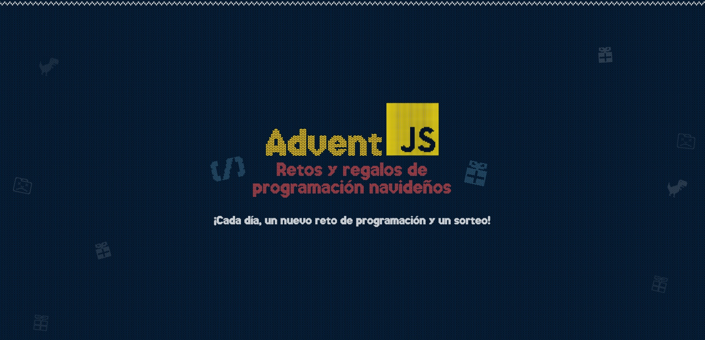
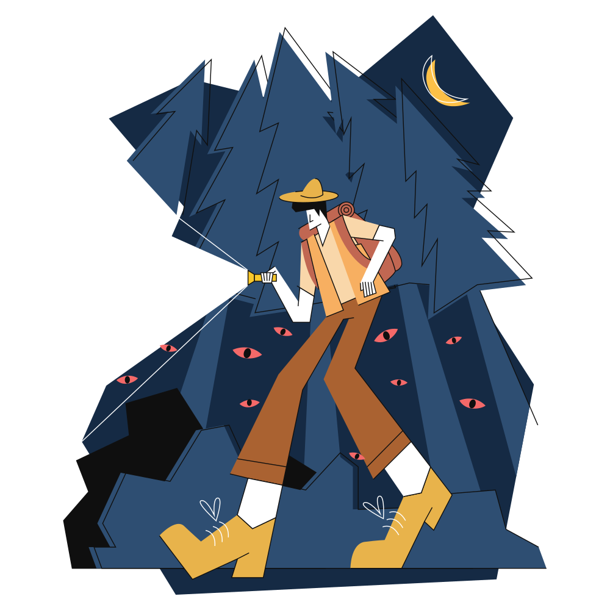
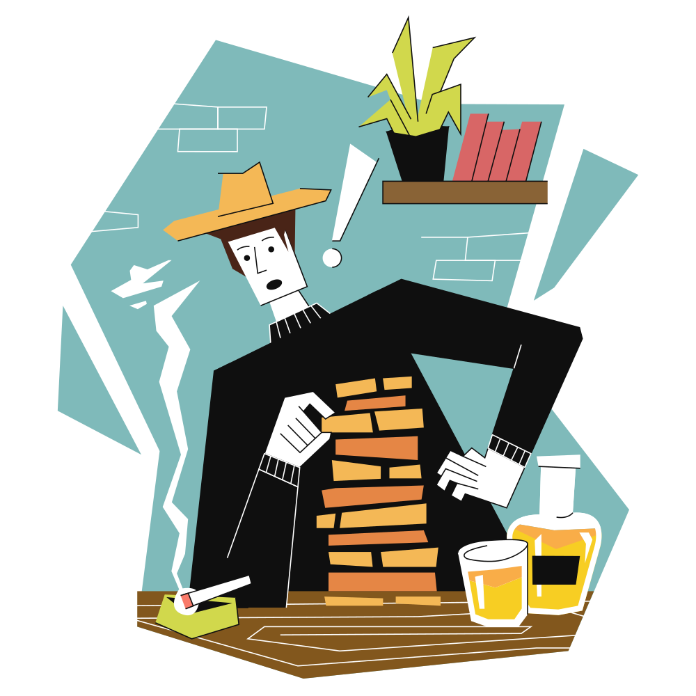
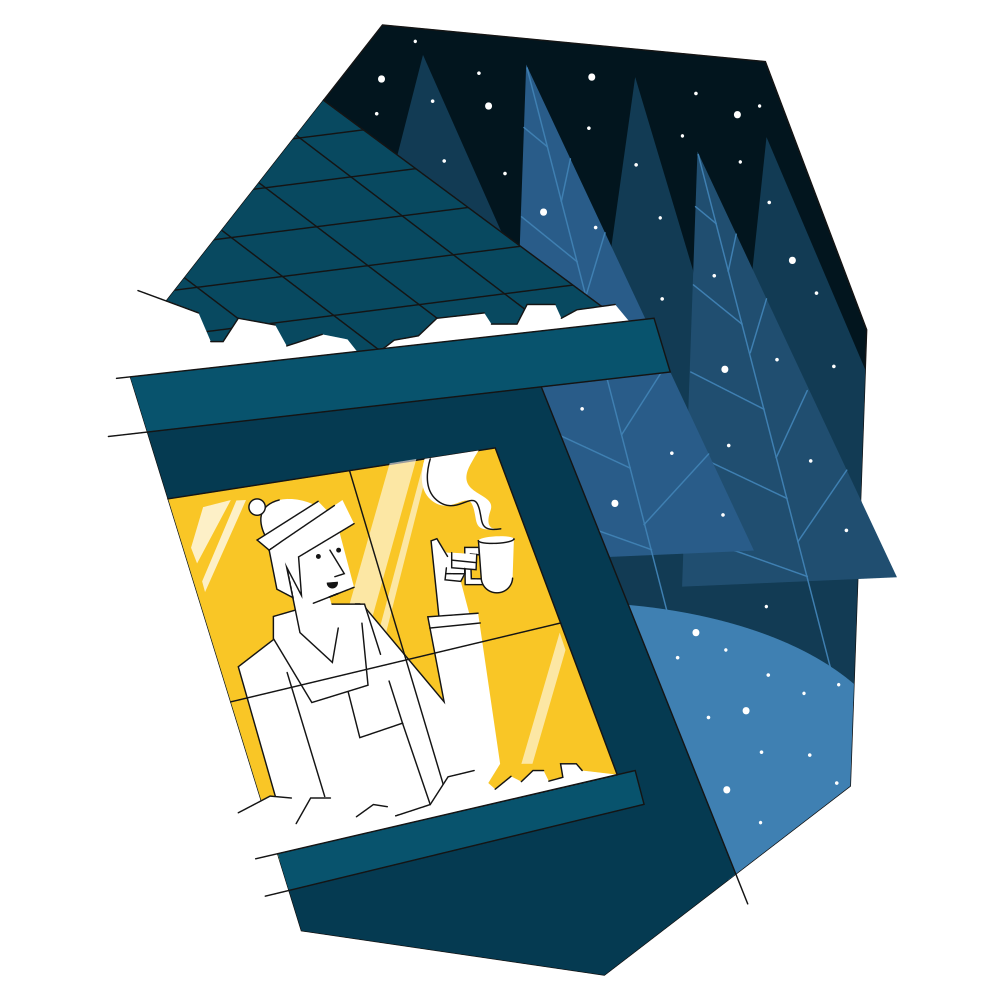

## Retos AdventJS 2022 🌟✨🎅🎄

##  [adventJS](https://adventjs.dev/es) es una iniciativa de [@midudev](https://midu.dev/)

## Retos 🎯

|                              Img                               | Reto |                                             Título                                             |        Descripción         | Dificultad |         Solución          | Puntos: 2364, º534 |
| :------------------------------------------------------------: | :--: | :--------------------------------------------------------------------------------------------: | :------------------------: | :--------: | :-----------------------: | :----------------: |
|   | #01  |    [¡Automatizando envolver regalos de navidad!](https://adventjs.dev/es/challenges/2022/1)    | [Ver](./Reto_01/README.md) |   Fácil    | [Ver](./Reto_01/index.js) |        106         |
|   | #02  |          [Nadie quiere hacer horas extra](https://adventjs.dev/es/challenges/2022/2)           | [Ver](./Reto_02/README.md) |   Fácil    | [Ver](./Reto_02/index.js) |         88         |
|   | #03  | [¿Cuántas cajas de regalos puede llevar Papá Noel?](https://adventjs.dev/es/challenges/2022/3) | [Ver](./Reto_03/README.md) |   Fácil    | [Ver](./Reto_03/index.js) |         44         |
|   | #04  |      [Una caja dentro de otra caja y otra...](https://adventjs.dev/es/challenges/2022/4)       | [Ver](./Reto_04/README.md) |   Medio    | [Ver](./Reto_04/index.js) |         10         |
|   | #05  |            [Optimizando viajes de Santa](https://adventjs.dev/es/challenges/2022/5)            | [Ver](./Reto_05/README.md) |  Difícil   | [Ver](./Reto_05/index.js) |         56         |
|   | #06  |             [Creando adornos navideños](https://adventjs.dev/es/challenges/2022/6)             | [Ver](./Reto_06/README.md) |   Medio    | [Ver](./Reto_06/index.js) |        120         |
|   | #07  |          [Haciendo inventario de regalos](https://adventjs.dev/es/challenges/2022/7)           | [Ver](./Reto_07/README.md) |   Fácil    | [Ver](./Reto_07/index.js) |         10         |
|   | #08  |             [¡Necesitamos un mecánico!](https://adventjs.dev/es/challenges/2022/8)             | [Ver](./Reto_08/README.md) |   Medio    | [Ver](./Reto_08/index.js) |         80         |
|   | #09  |            [Las locas luces de Navidad](https://adventjs.dev/es/challenges/2022/9)             | [Ver](./Reto_09/README.md) |   Fácil    | [Ver](./Reto_09/index.js) |         10         |
|  | #10  |         [El salto del trineo de Papá Noel](https://adventjs.dev/es/challenges/2022/10)         | [Ver](./Reto_10/README.md) |   Medio    | [Ver](./Reto_10/index.js) |         10         |
|  | #11  |            [Papá Noel es Scrum Master](https://adventjs.dev/es/challenges/2022/11)             | [Ver](./Reto_11/README.md) |  Difícil   | [Ver](./Reto_11/index.js) |        260         |
|  | #12  |            [Trineos eléctricos, ¡guau!](https://adventjs.dev/es/challenges/2022/12)            | [Ver](./Reto_12/README.md) |   Medio    | [Ver](./Reto_12/index.js) |        280         |
|  | #13  |       [Backup de los archivos de Papá Noel](https://adventjs.dev/es/challenges/2022/13)        | [Ver](./Reto_13/README.md) |   Fácil    | [Ver](./Reto_13/index.js) |        260         |
|  | #14  |                 [El mejor camino](https://adventjs.dev/es/challenges/2022/14)                  | [Ver](./Reto_14/README.md) |   Medio    | [Ver](./Reto_14/index.js) |        300         |
|  | #15  |          [Decorando el árbol de Navidad](https://adventjs.dev/es/challenges/2022/15)           | [Ver](./Reto_15/README.md) |   Medio    | [Ver](./Reto_15/index.js) |         10         |
|  | #16  |        [Arreglando las cartas de Papá Noel](https://adventjs.dev/es/challenges/2022/16)        | [Ver](./Reto_16/README.md) |  Difícil   | [Ver](./Reto_16/index.js) |        200         |
|  | #17  |          [Llevando los regalos en sacos](https://adventjs.dev/es/challenges/2022/17)           | [Ver](./Reto_17/README.md) |   Medio    | [Ver](./Reto_17/index.js) |         10         |
|  | #18  |             [¡Nos quedamos sin tinta!](https://adventjs.dev/es/challenges/2022/18)             | [Ver](./Reto_18/README.md) |   Fácil    | [Ver](./Reto_18/index.js) |         80         |
|  | #19  |              [Ordenando los regalos](https://adventjs.dev/es/challenges/2022/19)               | [Ver](./Reto_19/README.md) |   Fácil    | [Ver](./Reto_19/index.js) |        300         |
|  | #20  |               [Más viajes retadores](https://adventjs.dev/es/challenges/2022/20)               | [Ver](./Reto_20/README.md) |  Difícil   | [😔](./Reto_20/index.js)  |   No completado    |
|  | #21  |           [Creando la tabla de regalos](https://adventjs.dev/es/challenges/2022/21)            | [Ver](./Reto_21/README.md) |   Medio    | [Ver](./Reto_21/index.js) |         10         |
|  | #22  |            [La iluminación en sintonía](https://adventjs.dev/es/challenges/2022/22)            | [Ver](./Reto_22/README.md) |   Fácil    | [Ver](./Reto_22/index.js) |        120         |
|  | #23  |             [Compilador de Papá Noel](https://adventjs.dev/es/challenges/2022/23)              | [Ver](./Reto_23/README.md) |  Difícil   | [😔](./Reto_23/index.js)  |   No completado    |
|  | #24  |          [El último reto es un laberinto](https://adventjs.dev/es/challenges/2022/24)          | [Ver](./Reto_24/README.md) |  Difícil   | [😔](./Reto_24/index.js)  |   No completado    |
