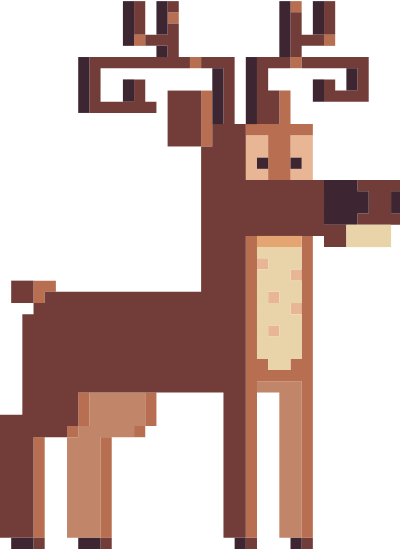

# [Reto #10: Crea tu propio árbol de navidad](https://adventjs.dev/es/challenges/2023/10)



¡Vaya idea ha tenido Sam Elfman! Quiere ofrecer un servicio que te crea un <strong style="color:rgb(250 202 2)">árbol de Navidad 🎄 personalizado</strong> en cuestión de segundos.

Para crearlo nos pasan una **cadena de caracteres para formar el árbol** y un **número que indica la altura del mismo**.

Cada carácter de la cadena representa un adorno del árbol, y vamos utilizándolos **de forma cíclica** hasta llegar a la altura indicada. Como mínimo **siempre nos pasarán uno**.

Debemos devolver un **string** multilínea con el árbol de Navidad formado con los adornos, la altura indicada **más una última línea con el tronco formado por el carácter |** en el centro y, finalmente, un salto de línea \n.

Por ejemplo si recibimos la cadena "123" y el número 4 como altura, tendríamos que construir este árbol:

```js
  1
  2 3
 1 2 3
1 2 3 1
   |
```

Si recibimos la cadena \*@o y el número 3, el árbol que debemos devolver es:

```js
  *
 @ o
* @ o
  |
```

_Nota_:

- El árbol siempre debe estar centrado, para ello añade espacios en blanco a la izquierda de cada línea.
- Crea espacios sólo a la izquierda de cada línea del árbol. No dejes espacios en blanco a la derecha.
- Los adornos tienen un espacio en blanco entre ellos de separación.
- Si te fallan los tests y visualmente parece que el árbol está bien, comprueba que no haya espacios en blanco que sobren, especialmente a la derecha de cada línea.

---

## Resultados

### Test #01

```js
Test: return type;

Expected: 'string';

Actual: 'string';
```

### Test #02

```js
Test: createChristmasTree("x", 3)

Expected:
"  x
 x x
x x x
  |
"

Actual:
"  x
 x x
x x x
  |
"
```

### Test #03

```js
Test: createChristmasTree("xo", 4)

Expected:
"   x
  o x
 o x o
x o x o
   |
"

Actual:
"   x
  o x
 o x o
x o x o
   |
"
```

### Test #04

```js
Test: createChristmasTree("123", 5)

Expected:
"    1
   2 3
  1 2 3
 1 2 3 1
2 3 1 2 3
    |
"

Actual:
"    1
   2 3
  1 2 3
 1 2 3 1
2 3 1 2 3
    |
"
```

### Test #05

```js
Test: createChristmasTree("*@o", 3)

Expected:
"  *
 @ o
* @ o
  |
"

Actual:
"  *
 @ o
* @ o
  |
"
```
